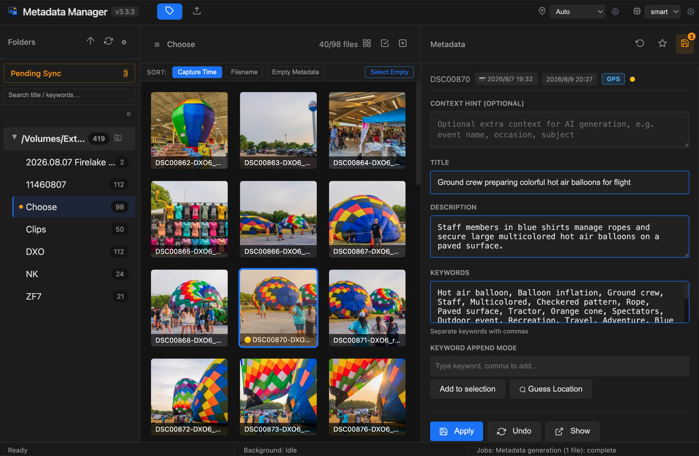
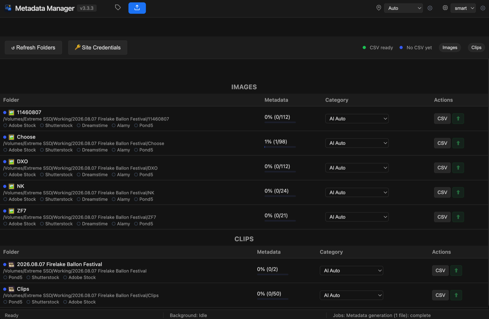
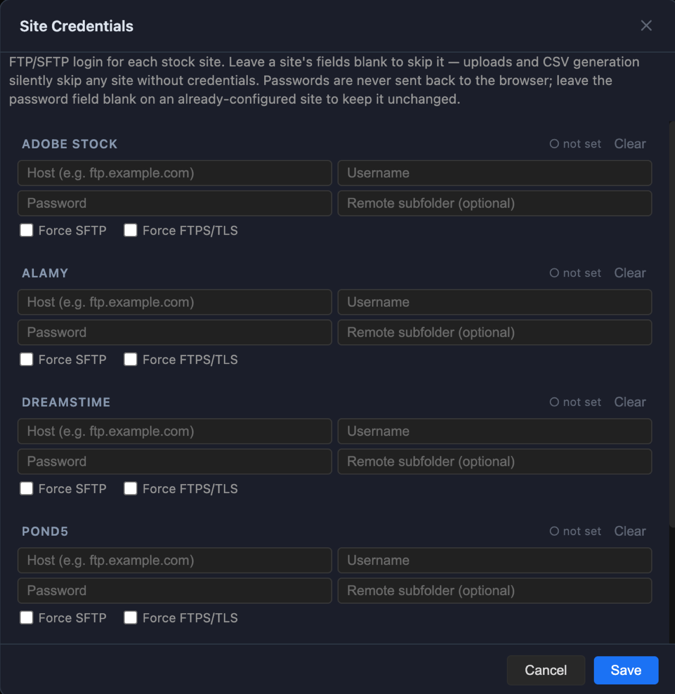

# ToTag

A local-first metadata manager for stock photographers: browse your photo/video
folders, write IPTC/XMP title/description/keywords straight to the file (JPG,
HEIC, RAW, MP4, MOV — Lightroom can't write metadata into video files, which
is the itch this scratches), generate that metadata with a vision LLM, and
upload to stock sites over FTP/SFTP.

**Status: usable, macOS-ready, still rough around the edges.** This is a
public spin-off of a tool I use daily for my own workflow. The
personal-workflow-only code has been stripped out and `python app.py` does
work — see [Known gaps](#known-gaps) below for what's still missing (mainly
code organization and test coverage, not missing functionality). Feel free
to poke around, try it, or open issues.

## Screenshots

| Metadata editor | Export / Upload |
|---|---|
|  |  |

<details>
<summary>Site Credentials settings</summary>



</details>

## Why this exists

I shoot stock photo and video. Lightroom handles title/description/keywords
fine for images, but it **can't write metadata into video files at all** —
every clip has to be tagged some other way before upload. On top of that,
stock sites want per-site CSV exports and FTP uploads, which is its own
manual chore regardless of image or video.

The design goals, in order:

1. **Local-first.** Your files never leave your machine except to the two
   places you explicitly point it at: an AI endpoint (for generation) and a
   stock site's FTP/SFTP (for upload). No account, no cloud database, no
   subscription — it's a Flask process reading and writing files on disk.
2. **A draft, not an oracle.** AI-generated title/description/keywords are
   written into an editable form, not straight to the file. You review,
   fix, and explicitly hit Apply before anything touches the file's
   metadata. The AI is there to save you from a blank textbox, not to
   replace judgment about what's actually in the photo.
3. **One tool for the whole pipeline.** Browse → tag → export CSV → upload
   → (optionally) clean up, without switching apps for the video-tagging
   gap Lightroom leaves.

## Architecture

No build step, no framework lock-in — the whole thing is a single Flask
process plus a vanilla-JS single-page frontend.

```
Browser (static/js/app.js, no framework)
    │  fetch() + Server-Sent Events
    ▼
Flask app (app.py)
    │
    ├── SQLite (models/db.py) ── an index/cache of what's on disk,
    │                             NOT the source of truth. The source of
    │                             truth is always the file's own metadata
    │                             fields, read/written via exiftool.
    │
    ├── core/ai_generation.py ── frame prep (Pillow/ffmpeg) → prompt
    │                             build → vision-model call → parse →
    │                             keyword postprocess. No Flask/DB
    │                             coupling — pure function in, dict out.
    │
    ├── core/geocoding.py ────── GPS → reverse geocode (Google) + OSM
    │                             Overpass containment lookup (finds the
    │                             enclosing national/state/city park by
    │                             polygon, immune to GPS drift).
    │
    ├── core/keywords.py ─────── text/keyword utilities shared by
    │                             generation and geocoding (cleaning,
    │                             dedup, proper-noun extraction).
    │
    ├── core/microstock.py ───── CSV generation per stock site's format,
    │                             FTP/SFTP upload with resume, folder
    │                             scanning/classification (images vs
    │                             clips, by extension).
    │
    ├── core/llm_config.py ───── AI endpoint base URL + API key, backed
    │                             by env vars with a JSON-file override
    │                             (write-only key, never echoed back).
    │
    └── core/binaries.py ─────── locates exiftool/ffmpeg/ffprobe
                                  (PATH first, Homebrew-path fallback —
                                  needed because launchd-style startup
                                  gets a minimal PATH).
```

**Jobs run server-side, not per-request.** Metadata generation, CSV
generation, and uploads can take a while (a batch of 100 photos against a
local LLM, an FTP upload over a slow link), so they run in a background
`ThreadPoolExecutor` and stream progress to the browser over SSE
(`/api/jobs/<id>/stream`). A job survives a page reload — reconnect and it
picks the stream back up, and jobs waiting on the same folder/options get
coalesced into one instead of piling up duplicate work.

**The AI model dropdown is one setting, used everywhere.** Metadata
generation and the Export tab's "AI Auto" CSV category classification both
read the same active-model selection — there's no separate model per
feature to lose track of.

## Choosing a model: local vs. cloud

Any OpenAI-compatible **vision** endpoint works — set the base URL and key
via the AI Endpoint section in the model settings, or `.env`. Two broad
choices:

**Cloud (e.g. OpenAI `gpt-4o-mini`)**
- Zero setup beyond an API key — no GPU, no local server to keep running.
- Consistent quality with no hardware-dependent variance.
- Costs per image/frame, and your photo is sent to a third party for every
  generation call. Fine for occasional use; adds up over a batch of
  thousands.

**Local (e.g. Qwen2.5-VL, InternVL2, MiniCPM-V via LM Studio, Ollama, MLX,
or vLLM)**
- Free per-call and fully private — nothing leaves your machine.
- Needs a model that's actually **vision-capable** — plenty of popular
  local models (Llama text models, DeepSeek-R1, etc.) can't take an image
  input at all, so check that specifically before picking one.
- Quality and speed both depend heavily on model size vs. your hardware.
  On Apple Silicon, MLX-quantized vision models in the 7B–35B range run
  well; a 30B+ model gives noticeably better instruction-following (title
  length, keyword relevance) than a 7B one, at the cost of tokens/sec.
- Any OpenAI-compatible server works as the endpoint — LM Studio's local
  server, Ollama (with an OpenAI-compatible route), vLLM, or a router like
  LiteLLM in front of several backends. Point `TOTAG_LLM_BASE_URL` at it.

**Rule of thumb:** cloud for trying the tool out or occasional single-shot
tagging; local once you're running this against real batches regularly —
the per-call cost and image-privacy tradeoff of cloud stops making sense
at volume.

## What it does

- Three-pane browser (folders / thumbnails / metadata) over your own local
  folders — no cloud upload, no subscription.
- Reads and writes title/description/keywords via `exiftool`, to both
  XMP and IPTC fields.
- AI-generated metadata: point it at an image or video, get a title,
  description, and keyword list back, written straight into the fields above.
  Works with any OpenAI-compatible vision endpoint (OpenAI itself, or a
  self-hosted server).
- GPS-aware keyword enrichment — reverse geocoding plus OSM containment
  lookups so a photo shot inside a national park or city park gets that
  park's name as a keyword, even if the GPS fix is a little off.
- CSV export + FTP/SFTP upload for stock sites (Shutterstock, Adobe Stock,
  Dreamstime, Alamy, Pond5), with per-file progress and resume. Sites
  without configured credentials are skipped automatically, not treated
  as an error.
- Live progress while AI generation runs — a spinner badge on the
  in-flight thumbnail, a status banner in the metadata panel, and a busy
  Gen AI button, so it's clear the app is working, not stuck.

## Requirements

- **macOS-ready today.** This is a Flask web app, so the framework itself is
  cross-platform, but it's only been built and tested on macOS. Two things
  are macOS-specific: the folder picker (native "Choose Folder" dialog, via
  `osascript` — falls back to pasting a path by hand elsewhere) and the
  `exiftool`/`ffmpeg`/`ffprobe` lookup in `core/binaries.py` (checks `PATH`
  first, then a Homebrew-path fallback). Running on Linux/Windows will
  likely need `core/binaries.py`'s fallback paths adjusted for where those
  tools live on your system, and hasn't been otherwise verified there — PRs
  welcome.
- Python 3.11+
- [`exiftool`](https://exiftool.org/) and `ffmpeg`/`ffprobe` (`brew install
  exiftool ffmpeg`)
- An OpenAI-compatible API key for the AI generation feature (optional —
  everything else works without one)

## Setup

```bash
pip install -r requirements.txt
cp .env.example .env   # fill in your folders + API key
python3 app.py
```

Visit `http://localhost:5001`.

## Usage

1. **Point it at your folders.** First run shows an empty folder list — use
   the gear icon (⚙) or the native folder picker to add one or more roots.
   Every image/video under those roots gets scanned and shows up in the
   left-hand folder tree.
2. **Browse and tag.** Click a folder, select one or more thumbnails, and
   the metadata panel on the right shows title/description/keywords for
   the current file(s). Edit by hand, or click **Gen AI** to have the
   model draft them — review, adjust, then **Apply** to actually write to
   the file (nothing is written until you do).
3. **Location context (optional).** Set the Location dropdown to bias
   AI generation toward a place, or type a free-text Context Hint for
   one-off details the AI can't see (event name, occasion). GPS-tagged
   photos get automatic location keywords even without either.
4. **Export & upload.** Switch to the Export/Upload tab — folders are
   split into Images and Clips automatically (by file extension). Per
   folder: generate a CSV (AI Auto picks a category, or choose one
   manually), then Upload to any stock site you've configured credentials
   for under **🔑 Site Credentials**.

## Known gaps

- `app.py` is still a single file (~2500 lines) holding all the Flask
  routes and job orchestration. The actual generation/geocoding/keyword
  logic is already split into independent `core/` modules (see
  [Architecture](#architecture) above) — the routes themselves just
  haven't been broken up yet.
- No automated tests yet.

## License

MIT — see [LICENSE](LICENSE).
